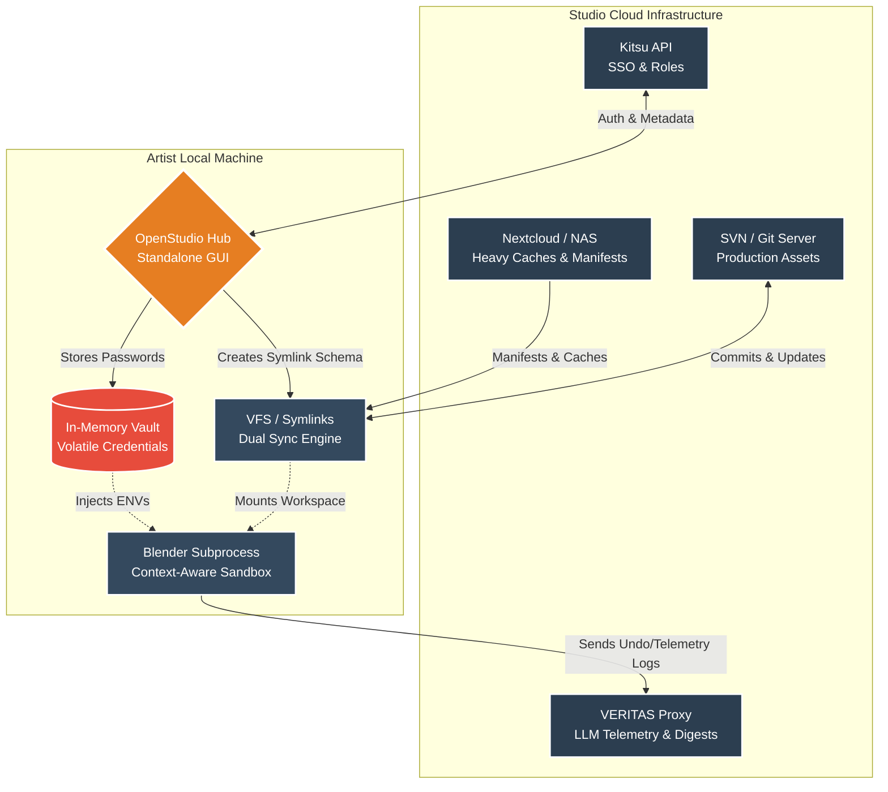
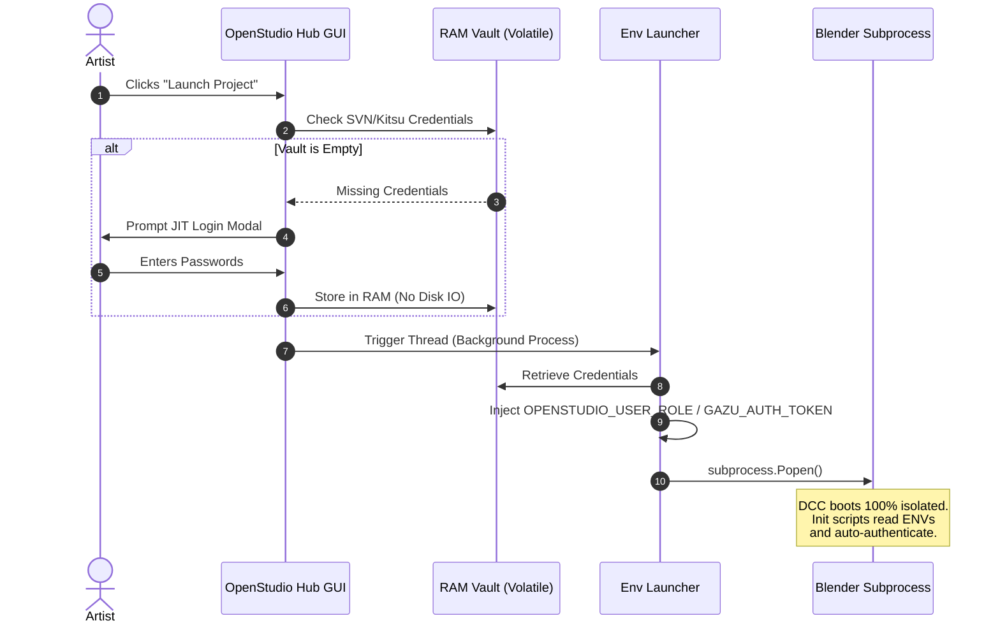

# OpenStudio Hub: Pipeline Management System


**OpenStudio Hub** (formerly Macuare Hub) is a standalone desktop application designed to orchestrate the production pipeline for a 3D animation studio. It acts as a seamless, deterministic bridge between artists, the version control system (SVN/Git), cloud storage (Nextcloud), and the production tracker (Kitsu).

> **[Watch the Demo Video Showcase Here](https://estudiomacuare.com/wp-content/uploads/macuare-hub-demo.mp4)**

*(Note: While the public and commercial name is OpenStudio Hub, the internal namespace and codebase may retain the legacy `MACUARE_` / `macuare_` prefix for structural stability)*.

## The Problem: Dependency Hell
In large-scale productions, updating software versions or add-ons mid-show often breaks backward compatibility. Artists waste hours dealing with Python tracebacks, missing add-ons, and manual path configurations just to open a legacy file without corrupting modern production data.

## The Solution: A "rez-like" Ephemeral Sandbox
OpenStudio Hub solves this by reading the "DNA" (`project_config.json`) of each project and **building dynamic software containers at runtime**. It bypasses global OS installations completely by injecting environment variables (`OPENSTUDIO_PROJECT_ROOT`, `OPENSTUDIO_USER_ROLE`) to isolate extensions, scripts, and preferences per project. 

This guarantees **100% backward compatibility** and allows artists to run conflicting legacy tools and modern pipelines simultaneously with zero cross-contamination[cite: 8].

---

## Core Pipeline Features

*   **Dual Sync & VFS Mapping (Symlinks):** Fuses Cloud (Nextcloud) and VCS (SVN) at the OS level. Heavy caches and renders go to the NAS, while `.blend` files go to SVN, appearing as a single continuous drive to the artist.
*   **Context-Aware Tooling & RBAC:** Automatically injects task-specific add-ons based on the Kitsu `TaskType` (e.g., Animation vs. Rigging) and restricts destructive actions (like Force Push) via Runtime Polling Override based on user roles.
*   **The Gatekeeper:** Enforces a strict Scene Sanity Check before publishing, automating scale fixes, orphan purging, and Out-of-Bounds reference resolution.
*   **AI Telemetry & Daily Digest:** A background tracker monitors artist activity and the Undo Stack, sending raw data to the VERITAS Proxy. This generates automated commit messages and an LLM-powered Daily Stand-up Digest for Supervisors.
*   **Vendor Jailing:** External freelancers are isolated via a Sparse Checkout engine, restricting their local workspace to strictly the task assigned to them.

---

## High-Level Studio Architecture



---

## Security: Just-In-Time (JIT) Credential Interception

Traditional pipelines often rely on saving plain-text network credentials on local disks, creating significant security vulnerabilities. OpenStudio Hub utilizes an **In-Memory Vault**. SVN and Kitsu passwords are asked once via a CustomTkinter modal, kept strictly in volatile RAM, injected into the DCC as OS environment variables during the subprocess launch, and wiped entirely upon logout.



---

## 💻 Development & Installation

The codebase is designed following the **Separation of Concerns (MVC)** principle and a strict **Concurrency Model**, ensuring the CustomTkinter GUI never blocks during heavy I/O or networking tasks (delegated to Worker Threads).

1. Clone the repository:

```bash
git clone [https://github.com/tu-usuario/openstudio-hub.git](https://github.com/tu-usuario/openstudio-hub.git)
cd openstudio-hub

```

2. Create and activate the virtual environment:

```bash
python -m venv .venv
source .venv/bin/activate  # Linux/Mac
# .venv\Scripts\activate  # Windows

```

3. Install dependencies:

```bash
pip install -r requirements.txt

```

4. Run the Hub:

```bash
python openstudio_hub.py

```

## Packaging for Production

To distribute the tool to studio artists without requiring them to install Python, the application is "frozen" into a standalone executable using PyInstaller.

```bash
pyinstaller --noconsole --onefile --name "OpenStudio Hub" openstudio_hub.py

```

*(Note: The compiled executable is not tracked in this repository. Please visit the **Releases** tab to download the latest production build)*.

---

*Developed by [Ernesto Del Valle M.] - Pipeline TD & Technical Artist.*
