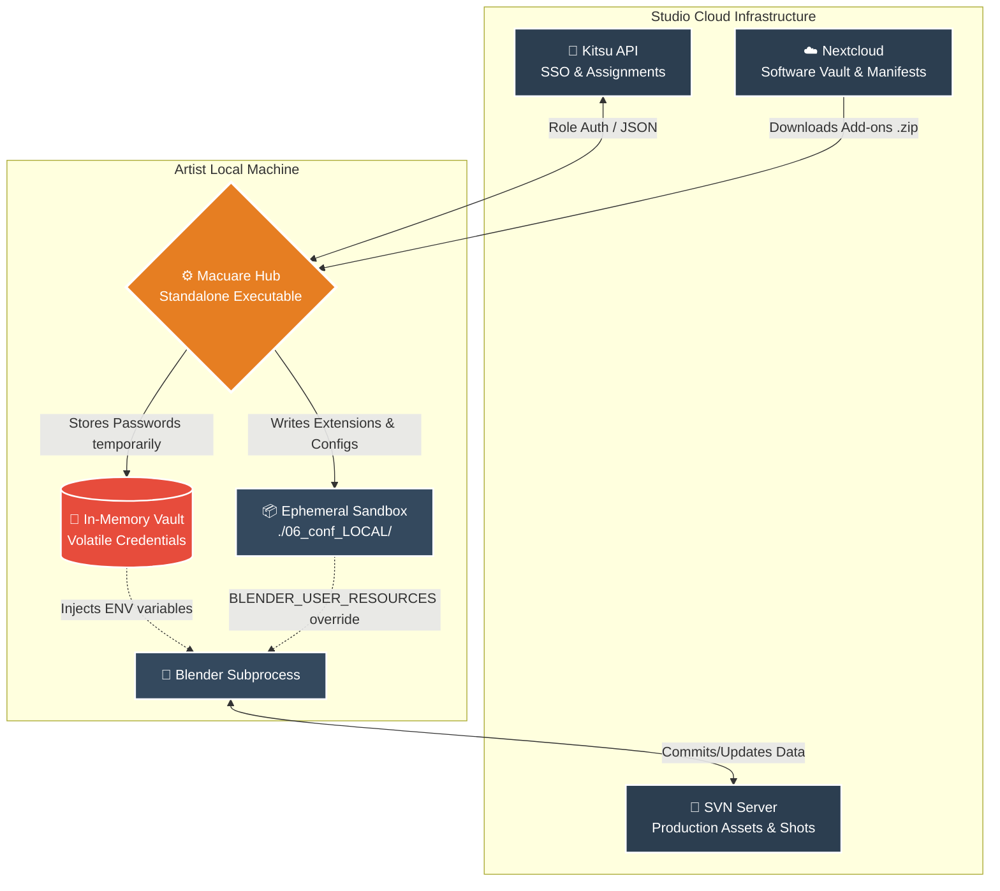
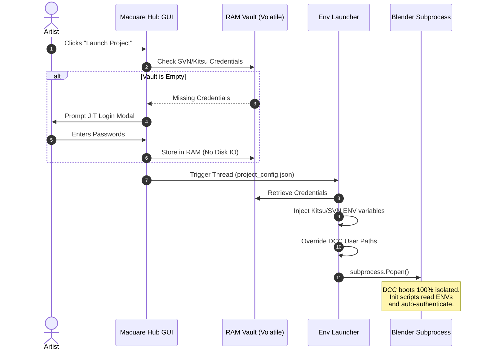

# Macuare Studio Hub: Pipeline Management System


**Macuare Hub** is a standalone desktop application designed to orchestrate the production pipeline for a 3D animation studio. It acts as a seamless, deterministic bridge between artists, the version control system (SVN/Nextcloud), and the production tracker (Kitsu).

> 🎬 **[Watch the Demo Video Showcase Here](https://estudiomacuare.com/wp-content/uploads/macuare-hub-demo.mp4)**

## ⚠️ The Problem: Dependency Hell
In large-scale productions, updating software versions or add-ons mid-show often breaks backward compatibility. Artists waste hours dealing with Python tracebacks, missing add-ons, and manual path configurations just to open a legacy file without corrupting modern production data.

## 💡 The Solution: A "rez-like" Ephemeral Sandbox
Macuare Hub solves this by reading the "DNA" (`project_config.json`) of each project and **building dynamic software containers at runtime**. It bypasses global OS installations completely by injecting environment variables (`BLENDER_USER_RESOURCES`, `BLENDER_USER_SCRIPTS`) to isolate extensions, wheels, and preferences per project. 

This guarantees **100% backward compatibility** and allows artists to run conflicting legacy tools (e.g., Blender 3.6) and modern pipelines (e.g., Blender 5.1) simultaneously with zero cross-contamination.

---

## 🏗️ High-Level Studio Architecture



---

## 🔒 Security: Just-In-Time (JIT) Credential Interception

Traditional pipelines often rely on saving plain-text network credentials on local disks, creating significant security vulnerabilities. Macuare Hub utilizes an **In-Memory Vault**. SVN and Kitsu passwords are asked once via a CustomTkinter modal, kept strictly in volatile RAM, injected into the DCC as OS environment variables during the subprocess launch, and wiped entirely upon logout.



---

## 💻 Development & Installation

The codebase is designed following the **Separation of Concerns (MVC)** principle, making it highly maintainable for Enterprise scaling.

1. Clone the repository:

```bash
git clone [https://github.com/tu-usuario/macuare-hub.git](https://github.com/tu-usuario/macuare-hub.git)
cd macuare-hub

```

2. Create and activate the virtual environment:

```bash
python -m venv .venv
source .venv/bin/activate  # Linux/Mac
# .venv\Scripts\activate  # Windows

```

3. Install dependencies:

```bash
pip install -r requirements.txt

```

4. Run the Hub:

```bash
python macuare_hub.py

```

## 📦 Packaging for Production

To distribute the tool to studio artists without requiring them to install Python, the application is "frozen" into a standalone executable using PyInstaller.

```bash
pyinstaller --noconsole --onefile --name "Macuare Hub" macuare_hub.py

```

*(Note: The compiled executable is not tracked in this repository. Please visit the **Releases** tab to download the latest production build).*

---

*Developed by [Ernesto Del Valle M.] - Pipeline TD & Technical Artist.*
