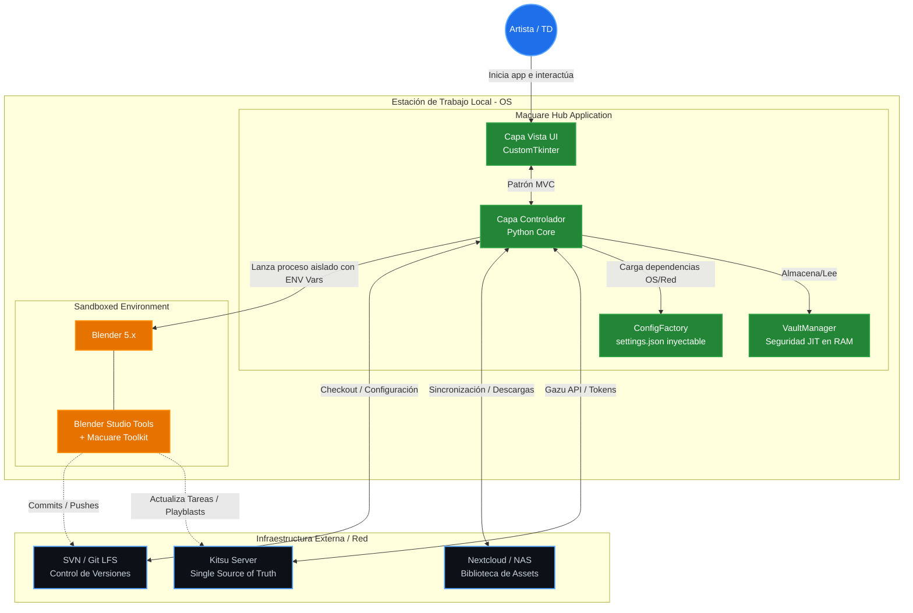

```mermaid
graph TD
    %% Estilos
    classDef cloud fill:#0d1117,stroke:#58a6ff,stroke-width:2px,color:#c9d1d9;
    classDef hub fill:#238636,stroke:#2ea043,stroke-width:2px,color:#ffffff;
    classDef blender fill:#e67300,stroke:#ff8c00,stroke-width:2px,color:#ffffff;
    classDef actor fill:#1f6feb,stroke:#58a6ff,stroke-width:2px,color:#ffffff;

    %% Actores Externos
    User((Artista / TD)):::actor

    %% Nube / Servidores (B2B Configurable)
    subgraph Cloud [Infraestructura Externa / Red]
        Kitsu[Kitsu Server <br/> Single Source of Truth]:::cloud
        Storage[Nextcloud / NAS <br/> Biblioteca de Assets]:::cloud
        VCS[SVN / Git LFS <br/> Control de Versiones]:::cloud
    end

    %% Ecosistema Local del Usuario
    subgraph LocalEnv [Estación de Trabajo Local - OS]
        
        %% Macuare Hub
        subgraph Hub [Macuare Hub Application]
            UI[Capa Vista UI <br/> CustomTkinter]:::hub
            Core[Capa Controlador <br/> Python Core]:::hub
            Vault[VaultManager <br/> Seguridad JIT en RAM]:::hub
            Config[ConfigFactory <br/> settings.json inyectable]:::hub
        end
        
        %% Entorno de Trabajo Aislado
        subgraph DCC [Sandboxed Environment]
            Blender[Blender 5.x]:::blender
            Addons[Blender Studio Tools <br/> + Macuare Toolkit]:::blender
        end
    end

    %% Relaciones y Flujos de Datos
    User -->|Inicia app e interactúa| UI
    UI <-->|Patrón MVC| Core
    
    Core -->|Almacena/Lee| Vault
    Core -->|Carga dependencias OS/Red| Config
    
    Core <-->|Gazu API / Tokens| Kitsu
    Core <-->|Sincronización / Descargas| Storage
    Core <-->|Checkout / Configuración| VCS
    
    Core -->|Lanza proceso aislado con ENV Vars| Blender
    Blender --- Addons
    
    %% Conexiones desde Blender (Post-Lanzamiento)
    Addons -.->|Actualiza Tareas / Playblasts| Kitsu
    Addons -.->|Commits / Pushes| VCS

```
